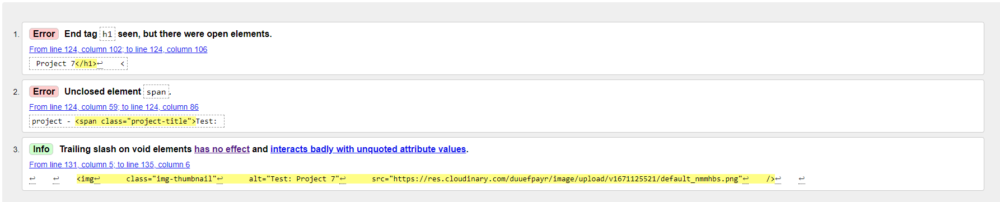
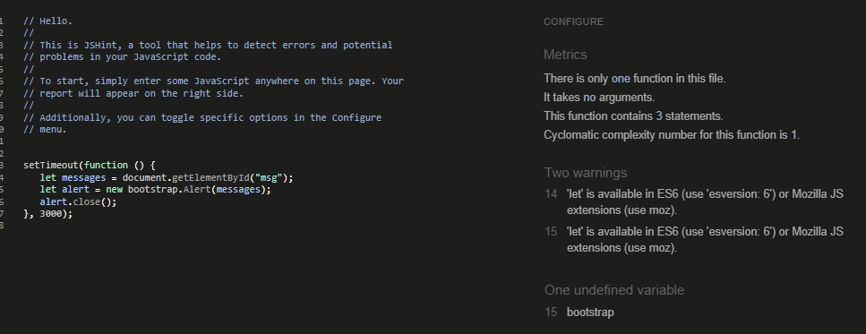

# ecabanas dev - ci portfolio

## Introduction
Welcome to my fourth project. This project is a simple portfolio, allow users to vote and comment projects. This will use languages such as Django, Python, HTML, CSS and JavaScript.

This project will show the use of CRUD functionality (Create, Read, Update, Delete). The admin will be able create, read, update and delete their projects.

A live website can be found [here](https://pp4-portfolio.herokuapp.com/).

# Table of Contents
 [1. UX Design](#ux)
- [User Goals:](#user-goals)
- [User Expectations:](#user-expectations)
- [User Stories:](#user-stories)
-	[Colour scheme and font](#color-scheme)
- [Website skeleton](#wireframes)

[2. Features](#features)

[3.Technologies](#technologies)

[4.Testing](#testing-phase)

[5.Bugs](#bugs)

[6. Deployment](#deployment)

[7. Acknowledgement](#acknowledgement)


<a name="ux"></a>
# 1. UX design
[Go to the top](#table-of-contents)

<a name="user-goals"></a>
## 1.1 User Goals
[Go to the top](#table-of-contents)

First-Time Visitor Goals
- As a first-time visitor, I want to see portfolio projects.
- As a first-time visitor, I want to see the project details.
- As a first-time visitor, I want to see the project user comments.
- As a first-time visitor, I want to see the project user likes.
- As a first-time visitor, I want to view the contact menu.
- As a first-time visitor, I want to be able to register on the website as a user.

Returning Visitor Goals

- As a Returning Visitor, I can login with my registered user.
- As a Returning Visitor, I can comment on published projects.
- As a Returning Visitor, I can like/dislike projects.

Frequent User Goals

- As a Frequent User, I want to check if there are any new projects.
- As a Frequent User, I want to check if there are any new comments on projects.

Admin User Goals

- As an admin, I want to manage projects (create, publish/unpublish, update and delete)
- As an admin, I want to manage projects comments (publish and delete)

<a name="user-expectations"></a>
## 1.2 User Expectations
[Go to the top](#table-of-contents)

- The design should be clear and clean.
- Easy navigation through the different pages.
- Compatible with all browsers.
- Responsive design and adaptable to all devices.
- Have the possibility of contacting the developer for any questions.

<a name="user-stories"></a>
## 1.3 User Stories
[Go to the top](#table-of-contents)

The project has been managed using the GitHub project boards tool. It is a very useful tool to classify the different tasks to be carried out in the project.


Link to user stories [here](https://github.com/users/ecabanasv/projects/10/views/1)

<a name="color-scheme"></a>
## 1.4 Color Scheme
[Go to the top](#table-of-contents)

The colour scheme of the project is quite simple and clean. The following colours used are presented below:

- Background: #212529
- Text: white
- Links: orange
- Hover link: yellow

The colour palette can be seen through the following [link](https://coolors.co/212529-ffffff-ff7f00-ffff00).

<a name="wireframes"></a>
## 1.5 Website Skeleton
[Go to the top](#table-of-contents)

### Desktop

<details> <summary>Desktop (click here to view)</summary>

Index:


About:


Portfolio - 1st page:


Portfolio - 2nd page:


Portfolio - Admin:


Portfolio - Unpublished:


Project details:


Project details - user:


Project details - admin:


Add new project:


Update project:


Delete project:


Contact:


Signup:


Login:


Logout:


</details>

### Mobile

<details> <summary>Mobile (click here to view)</summary>

Index:


About:


Portfolio:


Portfolio - admin:


Portfolio - unpublished:


Project details:


Project details - user:


Project details - admin:


Add new project:


Update project:


Delete project:


Contact:


Signup:


Login:


Logout:


</details>

<a name="features"></a>
# 2. Features
[Go to the top](#table-of-contents)

### All Pages

Header:


Messages:


Footer:


### Index

Index:


### About

About:


### Portfolio

User:


Admin:


Admin comments:


Pagination:


### Portfolio - Unpublished

Portfolio unpublished:


### Project details

Project details (non user):


Project details (user):


Project details (admin):


### Add new project

Add new project:


### Update project

Update project:


### Delete project

Delete project:


### Contact

Contact:


### Sign Up

Signup:


### Login

Login:


### Logout

Logout:


 <a name="technologies"></a>
# 3. Technologies Used
[Go to the top](#table-of-contents)

-   [HTML5](https://en.wikipedia.org/wiki/HTML)
    -   The project uses HyperText Markup Language.
-   [CSS3](https://en.wikipedia.org/wiki/CSS)
    -   The project uses Cascading Style Sheets.
-   [JavaScript](https://en.wikipedia.org/wiki/JavaScript)
    -   The project uses JavaScript.
-   [Python](https://en.wikipedia.org/wiki/Python_(programming_language))
    -   The project uses Python.
-   [Django](https://www.djangoproject.com/)
    -   The project uses Django framework for web development.
-   [Boostrap 5](https://getbootstrap.com/docs/5.0/getting-started/introduction/)
    -   The project uses Bootstrap 5.
-   [Elephant SQL](https://www.elephantsql.com/)
    -   The project uses ElephantSQL as a database hosting.
-   [PostgreSQL](https://www.postgresql.org/)
    -   The project uses PostgreSQL as a database.
-   [Visual Studio code](https://code.visualstudio.com/)
    -   The project uses Visual Studio code for developing.
-   [Firefox developer](https://www.mozilla.org/en-US/firefox/developer/)
    -   The project uses Firefox developer to debug and test the source code.
-   [Chrome](https://www.google.com/intl/en_uk/chrome/)
    -   The project uses Chrome Developer tools to test performance.
-   [Balsamiq](https://balsamiq.com/)
    -   Balsamiq was used to create the wireframes during the design process.
-   [Google Fonts](https://fonts.google.com/)
    -   Google fonts were used to import the "Be Vietnam Pro" font into the style.css file which is used on all pages throughout the project.
-   [GitHub](https://github.com/)
    -   GitHub was used to store the project's code after being pushed from Git.

<a name="testing-phase"></a>
# 4. Testing
[Go to the top](#table-of-contents)

## 4.1 Testing using tools

### 4.1.1 Browser Developer tools

#### Google Developer tools

Chrome DevTools is a set of web developer tools built directly into the Google Chrome browser. It was used in the project to test the performance of the different pages of the project. Also Lighthouse was used to check the accesibility of the web project.

### 4.1.2 Responsive Tools

[Am I Responsive](http://ami.responsivedesign.is) was used to make sure that all my pages are responsive to all devices.

### 4.1.3 W3C Validator Tools (HTML and CSS)

#### HTML

Index fails:



Index passed:


About:


Portfolio:


Project details:


Add project:


Delete project:


Contact:


Signup:


Login:


#### CSS

CSS Validator:


#### JavaScript

JavaScript validator:




#### Python

Admin:


Models:


URLs:


Views:


Forms:


## 4.2 Manual Testing

### All Pages

### Index

Lighthouse:


### About

Lighthouse:


### Portfolio

Lighthouse:


### Project details

Lighthouse:


### Contact

Lighthouse:


### Add new project

Lighthouse:


### Update project

Lighthouse:


### Delete project

Lighthouse:


### Sign Up

Lighthouse:


### Login

Lighthouse:


### Logout

Lighthouse:


<a name="bugs"></a>
# 5. Bugs
[Go to the top](#table-of-contents)

### Solved bugs

<a name="deployment"></a>
# 6. Deployment
[Go to the top](#table-of-contents)

## Deployment to Heroku

### 1. Creating the Django Project
* If development if being done locally: Activate your virtual environment
* To ensure the virtual environment is not tracked by version control, add .venv to the .gitignore file.
* Install Django and gunicorn: `pip install django gunicorn`
* Install supporting database libraries dj_database_url and psycopg2 library: `pip install dj_database_url psycopg2`
* Install Cloudinary libraries to manage static files: `pip install dj-3-cloudinary-storage`
* Create file for requirements: `pip freeze --local > requirements.txt`
* Create project:`django-admin startproject project_name .`
* Create app: `python manage.py startapp app_name`
* Add app to list of `installed apps` in settings.py file: `'app_name'`
* Migrate changes: `python manage.py migrate`
* Test server works locally: `python manage.py runserver`

### 2. Create your Heroku app
* Navigate to the Heroku website
* Create a Heroku account by entering your email address and a password (or login if you have one already).
* Activate the account through the authentication email sent to your email account
* Click the **new button** on the top right corner of the screen and select create a new app from the dropdown menu.
* Enter a unique name for the application.
* Select the appropriate region for the application.
* Click create app
* In the Heroku dashboard click on the Resources tab
* Scroll down to Add-Ons, search for and select 'Heroku Postgres'
* In the Settings tab, scroll down to 'Reveal Config Vars' and copy the text in the box beside DATABASE_URL.

### 3. Set up Environment Variables
* In you IDE create a new env.py file in the top level directory
* Add env.py to the .gitignore file
* In env.py import the os library
* In env.py add `os.environ["DATABASE_URL"]` = "Paste in the text link copied above from Heroku DATABASE_URL"
* In env.py add `os.environ["SECRET_KEY"] = "Make up your own random secret key"`
* In Heroku Settings tab Config Vars enter the same secret key created in env.py by entering 'SECRET_KEY' in the box for 'KEY' and your randomly created secret key in the 'value' box.

### 4. Setting up settings.py

* In your Django 'settings.py' file type:

 ```
 from pathlib import Path
 import os
 import dj_database_url

 if os.path.isfile("env.py"):
  import env
 ```
* Remove the default insecure secret key in settings.py and replace with the link to the secret key variable in Heroku by typing: `SECRET_KEY = os.environ.get(SECRET_KEY)`
* Comment out the `DATABASES` section in settings.py and replace with:
```
DATABASES = {
  'default': 
  dj_database_url.parse(os.environ.get("DATABASE_URL"))
  }`
```
* Create a Cloudinary account and from the 'Dashboard' in Cloudinary copy your url into the env.py file by typing: `os.environ["CLOUDINARY_URL"] = "cloudinary://<insert-your-url>"`
* In Heroku  add cloudinary url to 'config vars'
* In Heroku config vars add DISABLE_COLLECTSTATIC with value of '1' (note: this must be removed for final deployment)
* Add Cloudinary libraries to the installed apps section of settings.py file:
 ```
 'cloudinary_storage'
 'django.contrib.staticfiles''
 'cloudinary'
 ```
* Connect Cloudinary to the Django app in `settings.py`:
```
STATIC_URL = '/static'
STATICFILES_STORAGE = 'cloudinary_storage.storage.StaticHashedCloudinaryStorage'
STATICFILES_DIRS = [os.path.join(BASE_DIR, 'STATIC')]
STATIC_ROOT = os.path.join(BASE_DIR, 'staticfiles')
MEDIA_URL = '/media/'
DEFAULT_FILE_STORAGE =
'cloudinary_storage.storage.MediaCloudinaryStorage'
* Link file to the templates directory in Heroku 
* Place under the BASE_DIR: TEMPLATES_DIR = os.path.join(BASE_DIR,
'templates')
```
* Change the templates directory to TEMPLATES_DIR. Place within the TEMPLATES array: `'DIRS': [TEMPLATES_DIR]`
* Add Heroku Hostname to ALLOWED_HOSTS: ```ALLOWED_HOSTS =
['rhi-book-nook.herokuapp.com', 'localhost']```
*Create Procfile at the top level of the file structure and insert the following:
    ``` web: gunicorn PROJECT_NAME.wsgi ```

* Make an initial commit and push the code to the GitHub Repository.
    ```git add .```
    ```git commit -m "Initial deployment"```
    ```git push```

### 5. Heroku Deployment: 
* Click Deploy tab in Heroku
* In the 'Deployment method' section select 'Github' and click the 'connect to Github' button to confirm.
* In the 'search' box enter the Github repository name for the project
* Click search and then click connect to link the heroku app with the Github repository. The box will confirm that heroku is connected to the repository.

### 6. Final Deployment
In the IDE: 
* When development is complete change the debug setting to: `DEBUG = False` in `settings.py` 
* In Heroku settings config vars change the DISABLE_COLLECTSTATIC value to 0
* Because DEBUG must be switched to True for development and False for production it is recommended that only manual deployment is used in Heroku. 
* To manually deploy click the button 'Deploy Branch'. The default 'main' option in the dropdown menu should be selected in both cases. When the app is deployed a message 'Your app was successfully deployed' will be shown. Click 'view' to see the deployed app in the browser.

## To fork the repository on GitHub

A copy of the GitHub Repository can be made by forking the GitHub account. Changes can be made on this copy without affecting the original repository.

1. Log in to GitHub and locate the repository in question.
2. Locate the Fork button which can be found in the top corner, right-hand side of the page, inline with the repository name.
3. Click this button to create a copy of the original repository in your GitHub Account.

## To clone the repository on GitHub

1. Click on the code button which is underneath the main tab and repository name to the right.
2. In the 'Clone with HTTPS' section, click on the clipboard icon to copy the URL.
3. Open Git Bash in your IDE of choice.
4. Change the current working directory to where you want the cloned directory to be made.
5. Type git clone, and then paste the URL copied from GitHub.
6. Press enter and the clone of your repository will be created.

<a name="acknowledgement"></a>
# 7. Acknowledgement
[Go to the top](#table-of-contents)

### Code

### Content 


